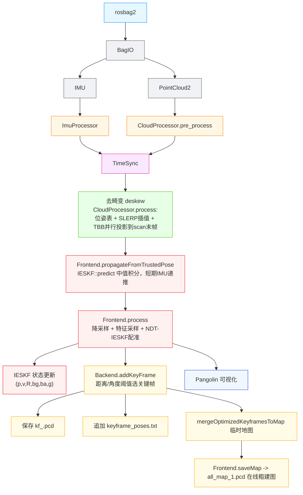
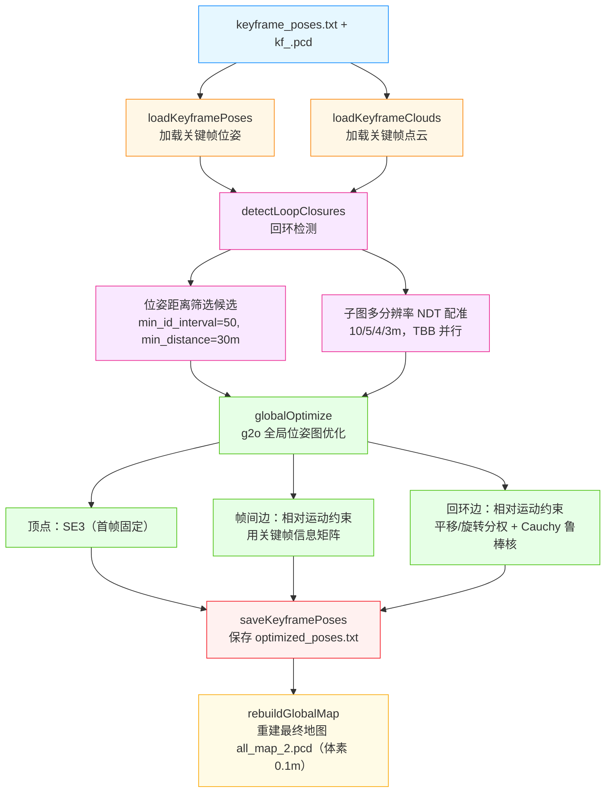
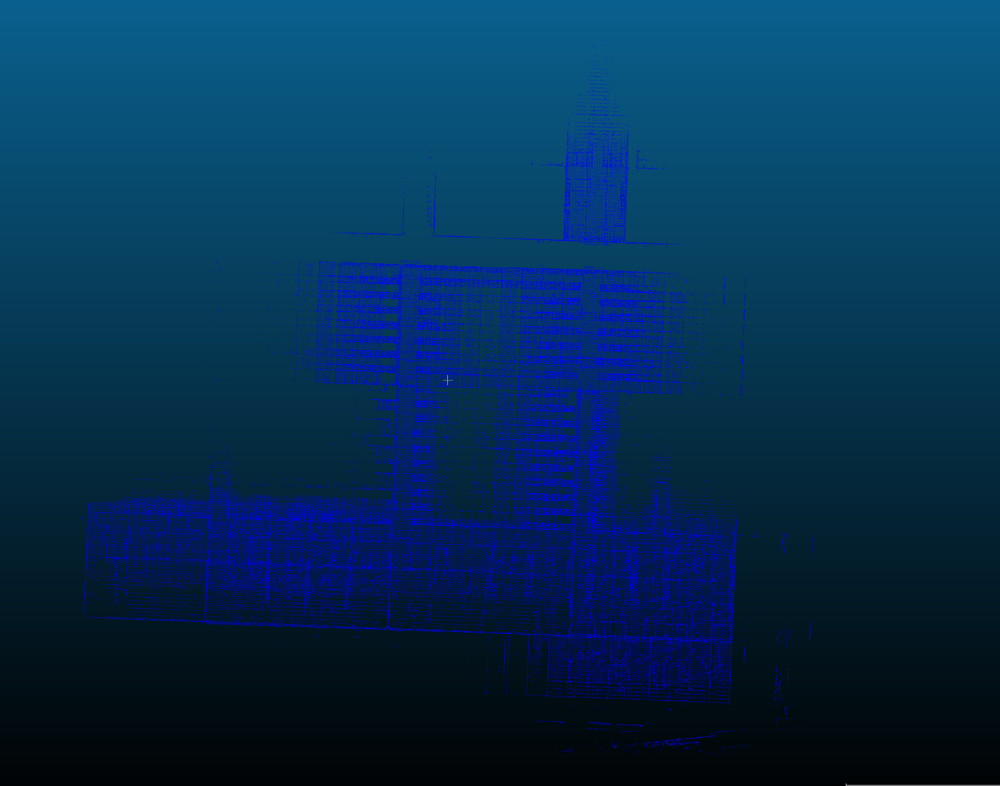
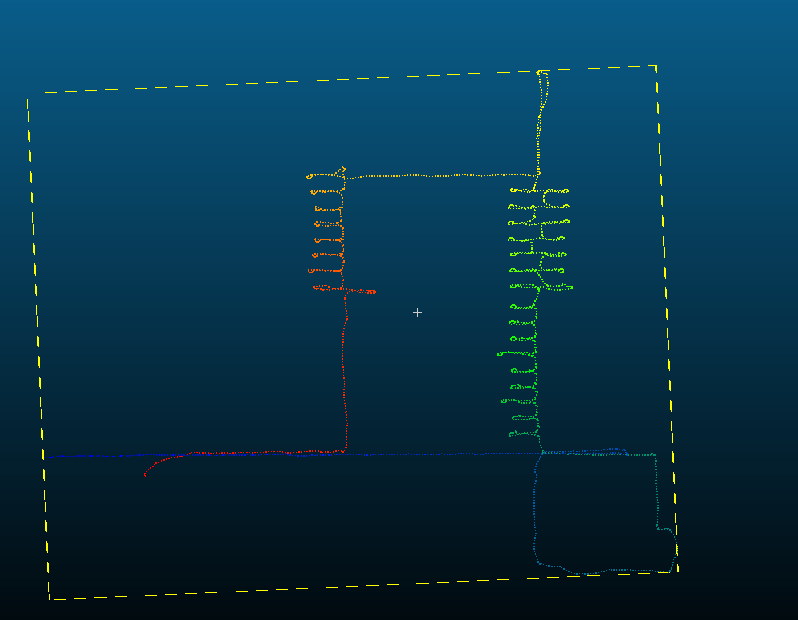
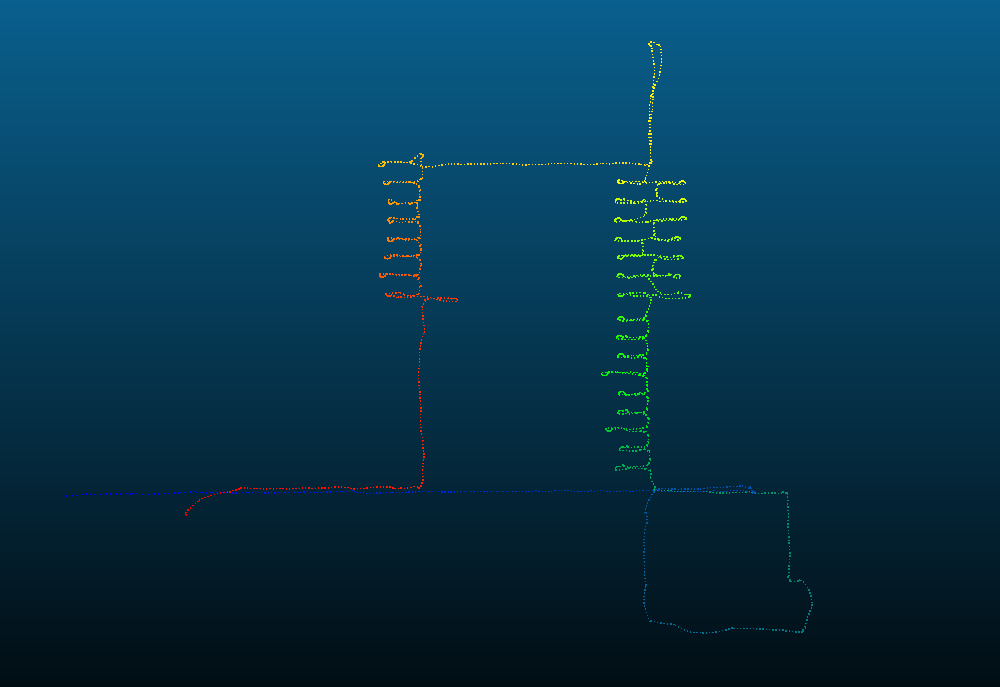
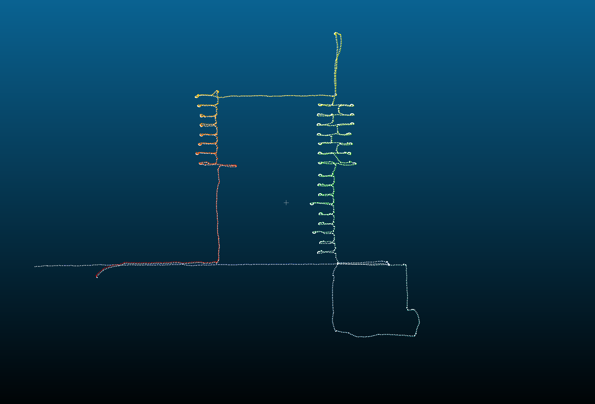
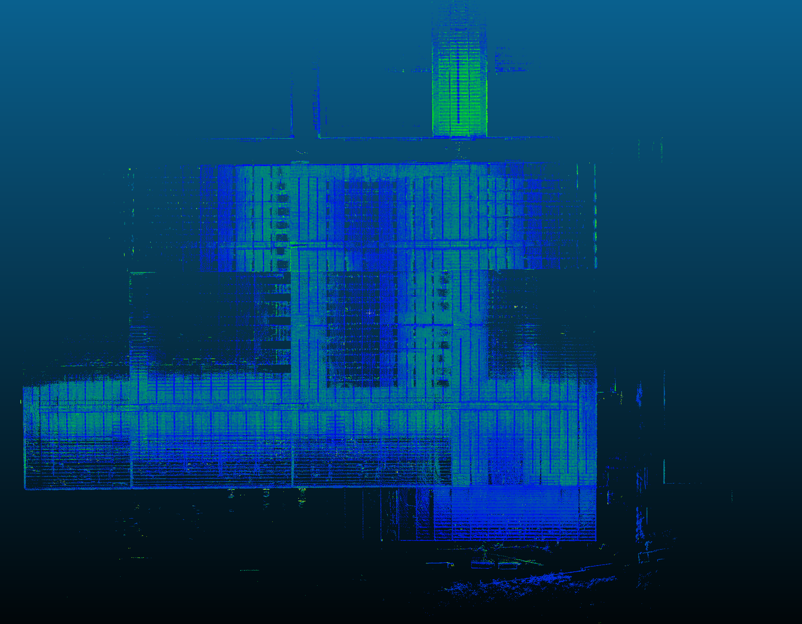

# lio2_slam

LIO-SLAM（LiDAR-Inertial Odometry and Mapping with SLAM）——基于**迭代误差状态卡尔曼滤波（IESKF）+ NDT 点云配准**的紧耦合激光-惯性里程计与建图系统。

系统分为**在线建图**与**离线后处理**两个独立可执行程序：

| 可执行程序 | 功能 | 源码入口 |
| --- | --- | --- |
| `run_mapping` | 在线 LIO：IMU 递推 + NDT-IESKF 配准，实时提取关键帧并保存位姿/点云，构建临时地图 | [src/app/run_lio_mapper.cpp](src/app/run_lio_mapper.cpp) |
| `run_optimizer` | 离线后处理：加载关键帧 → 回环检测（距离筛选 + NDT）→ g2o 全局位姿图优化 → 重建最终地图 | [src/app/run_lio_optimizer.cpp](src/app/run_lio_optimizer.cpp) |
| `test_g2o` | g2o 自定义顶点/边的最小示例（带障碍物的轨迹平滑） | [src/app/test_g2o.cpp](src/app/test_g2o.cpp) |

---

## 1. 目录结构

```
lio2_slam/
├── CMakeLists.txt            # 构建脚本（ament_cmake）
├── package.xml               # ROS2 包描述与依赖声明
├── config/
│   └── config.yaml           # 运行参数（bag 路径、话题、外参等）
├── thirdparty/
│   ├── sophus/               # 内置 Sophus（头文件库，无需单独安装）
│   └── lib_tar/              # 部分依赖源码安装包
├── src/
│   ├── app/                  # 三个可执行程序入口
│   ├── backend/              # 关键帧管理（KeyFrame / Backend）
│   ├── cloud_utils/          # 点云类型定义、预处理、去畸变
│   ├── estimator/            # IESKF（18-DOF 误差状态卡尔曼滤波）
│   ├── frontend/             # 前端：NDT 配准、体素地图、Frontend 主流程
│   ├── imu_utils/            # IMU 初始化、中值积分、插值
│   ├── loop_closure/         # 回环检测（距离筛选 + 子图 NDT）
│   ├── measure/              # 同步后的测量组定义
│   ├── postprocess/          # 位姿图优化、全局地图重建
│   ├── ros_bridge/           # rosbag2 读取
│   ├── sync/                 # IMU / 点云时间同步
│   ├── utils/                # Eigen/Sophus/g2o/ROS 类型别名与工具
│   └── visualization/        # Pangolin 可视化
└── log/                      # glog 运行日志输出目录
```

---

## 2. 依赖库、版本与安装方式

> 下表版本为作者开发机器上的实测版本

| 依赖库 | 版本 | 用途 | 安装方式 |
| --- | --- | --- | --- |
| Ubuntu | 22.04.5 LTS | 操作系统 | — |
| ROS2 | Humble | 通信 / rosbag2 | 见 [官方安装](https://docs.ros.org/en/humble/Installation.html) |
| CMake | ≥ 3.8（实测 3.22.1） | 构建 | `sudo apt install cmake` |
| g++ | 11.4.0（需支持 C++17） | 编译 | `sudo apt install build-essential` |
| Eigen3 | 3.4.0 | 线性代数 | `sudo apt install libeigen3-dev` |
| PCL | 1.12.1 | 点云处理 / NDT | `sudo apt install libpcl-dev` |
| OpenCV | 4.5.4 | （当前仅被链接，图像相关能力预留） | `sudo apt install libopencv-dev` |
| yaml-cpp | 0.7.0 | 解析 config.yaml | `sudo apt install libyaml-cpp-dev` |
| TBB | 2021.5.0 | 并行去畸变 / 回环 | `sudo apt install libtbb-dev` |
| Boost | 1.74.0 | ROS2 传递依赖 | `sudo apt install libboost-all-dev` |
| glog | 源码编译（`thirdparty/lib_tar/glog-0.7.2.tar.gz`） | 日志 | 见下方说明 |
| g2o | 源码编译（`thirdparty/lib_tar/g2o.tar.gz`） | 位姿图优化 | 见下方说明 |
| Pangolin | 源码编译（`thirdparty/lib_tar/Pangolin-0.9.tar.gz`） | 可视化 | 见下方说明 |
| Sophus | 内置（`thirdparty/sophus`） | 李群 SE3/SO3 | 无需单独安装 |

### 2.1 ROS2 相关依赖

```bash
# ROS2 Humble 安装后，安装本包声明的 ROS 依赖（见 package.xml）
sudo apt install ros-humble-rclcpp \
                 ros-humble-sensor-msgs \
                 ros-humble-geometry-msgs \
                 ros-humble-nav-msgs \
                 ros-humble-std-msgs \
                 ros-humble-std-srvs \
                 ros-humble-tf2 \
                 ros-humble-tf2-ros \
                 ros-humble-tf2-geometry-msgs \
                 ros-humble-pcl-conversions \
                 ros-humble-rosbag2-cpp
```


### 2.2 glog

```bash
cd thirdparty/lib_tar/ && tar -xzvf glog-0.7.2.tar.gz
cd glog-0.7.2
mkdir build && cd build
cmake ..
make -j$(nproc)
sudo make install
sudo ldconfig
```

### 2.3 g2o

```bash
cd thirdparty/lib_tar/ && tar -xzvf g2o.tar.gz
cd g2o
mkdir build && cd build
cmake ..
make -j$(nproc)
sudo make install
sudo ldconfig
```

编译后会生成 `/usr/local/lib/libg2o_core.so`、`libg2o_stuff.so`、`libg2o_solver_cholmod.so`、`libg2o_types_slam3d.so` 等，与 [CMakeLists.txt](CMakeLists.txt) 中的 `find_library` 路径对应。

### 2.4 Pangolin

```bash
cd thirdparty/lib_tar/ && tar -xzvf Pangolin-0.9.tar.gz
cd Pangolin
# 先安装依赖
sudo apt install libgl1-mesa-dev libglew-dev libpython3-dev
mkdir build && cd build
cmake ..
make -j$(nproc)
sudo make install
sudo ldconfig
```

---

## 3. 编译方式

本项目为 ROS2 `ament_cmake` 包，使用 **colcon** 编译（需将源码放在 ROS2 工作空间的 `src/` 下，如 `~/hub_ws/src/lio2_slam`）。

```bash
cd ~/hub_ws                                     # 进入工作空间根目录
source /opt/ros/humble/setup.bash               # 加载 ROS2 环境
colcon build --packages-select lio2_slam        # 编译
source install/setup.bash                       # 加载编译产物
```

> **编译说明**：[CMakeLists.txt](CMakeLists.txt) 中 `CMAKE_BUILD_TYPE` 被 `FORCE` 为 `Release`，且 Release 模式使用 `-O3 -march=native -ffast-math -funroll-loops`。`-march=native` 会针对当前 CPU 生成指令，因此**编译产物与编译机器绑定**，换机器需重新编译。

---

## 4. 算法流程

### 4.1 在线建图（`run_mapping`）

整体数据流见下图：



**关键步骤说明：**

1. **IMU 初始化（静止标定）**：`ImuProcessor` 采集前 200 帧 IMU，计算陀螺仪/加速度计方差判断是否静止；静止则估计 `bg`（陀螺零偏）、`ba`（设为 0）、重力方向与加速度计放缩系数 `acc_scale`，得到初始姿态（重力对齐）。若噪声过大则重试（最多 5 次，失败走降级默认值）。
2. **IMU 状态链递推**：初始化后，用中值积分 + 姿态积分（`deltaQ`）持续递推出一条 IMU 姿态链 `states_`（仅保留最近 5s），供去畸变与插值使用。
3. **点云预处理**：`CloudProcessor.pre_process` 从 `PointCloud2` 中提取 `x/y/z/intensity/timestamp`，过滤 NaN 点与距原点过近（< 0.5m）的点。
4. **时间同步**：`TimeSync` 将 IMU 缓冲与点云缓冲对齐，输出每帧扫描对应的 `MeasureGroup`（含该帧 IMU 序列与扫描起止时间）。
5. **运动畸变校正（deskew）**：以 1ms 为间隔构建位姿表（SLERP + 平移线性插值），将每个点经 `lidar→imu→world→scan末帧` 变换，用 TBB 并行完成。
6. **短期 IMU 递推**：`Frontend.propagateFromTrustedPose` 从上一帧可靠状态出发，用中值积分把状态递推到当前点云时刻，作为配准初值。
7. **NDT + IESKF 配准（核心）**：
   - 状态量为 18 维误差状态 `[δp, δv, δR, δbg, δba, δg]`，其中 `bg/ba/g` 均在线估计（g 的在线修正是抑制 Z 轴漂移的关键）。
   - NDT 以**观测回调**形式集成到 IEKF 迭代中：每次迭代用最新名义位姿重新线性化，累加信息形式的 `HᵀV⁻¹H` 与 `HᵀV⁻¹r`，与 IMU 先验协方差同时作用。
   - NDT 配准在体素地图（`VoxelMap`，voxel 0.5m / block 20m）上进行，`NDTRegistration` 输出 6×6 位姿协方差。
8. **关键帧管理**：`Backend` 依据与上一关键帧的**相对平移（默认 1.0m）或相对旋转（默认 0.175 rad ≈ 10°）**选取关键帧；采用分级内存管理（先释放已合并关键帧的点云，再淘汰最老关键帧位姿）。
9. **信息矩阵**：从 IESKF 的 18×18 协方差中提取 6×6 位姿协方差，经特征值正则化求逆得到关键帧信息矩阵，写入 `keyframe_poses.txt` 供后续图优化使用。
10. **在线粗建图**：程序结束时 `saveMap` 用所有关键帧位姿重建点云，保存为 `all_map_1.pcd`。

### 4.2 离线后处理（`run_optimizer`）



**回环检测**：先基于关键帧位姿的 xy 距离（< 30m）粗筛候选（同时满足 ID 间隔 ≥ 50、跳帧 `skip_id=5`），再对每个候选以目标关键帧为中心构建局部子图（子图半径 40 帧、步长 4 帧），用多分辨率（10→5→4→3m）NDT 对源关键帧配准，NDT 得分超过阈值（3.0）即判定为回环。

**全局优化**：使用 g2o 自定义的 `VertexPose`（6-DOF SE3，旋转在前）与 `EdgeRelativeMotion`（6-DOF 相对运动）：
- **帧间约束**：信息矩阵取自关键帧的 6×6 信息矩阵（带行列式/特征值异常检查与缩放）。
- **回环约束**：平移与旋转权重**分别赋权**（`loop_trans_std=0.20m`、`loop_rot_std=0.03rad`），并叠加 `Cauchy` 鲁棒核（delta=0.2）以抑制误回环影响。
- Levenberg-Marquardt 迭代 50 次收敛。

---

## 5. 启动方式

### 5.1 运行前准备

1. 编辑 [config/config.yaml](config/config.yaml)，至少修改 `bag_file`（rosbag2 目录）与 `save_map_path`（结果输出目录）。
2. 确认 `save_map_path` 目录存在（不存在时关键帧点云目录会在首帧自动创建）。

### 5.2 在线建图

```bash
cd ~/hub_ws
source /opt/ros/humble/setup.bash
source install/setup.bash

ros2 run lio2_slam run_mapping
```

### 5.3 离线后处理（回环 + 全局优化）

> 需先运行 `run_mapping` 生成 `keyframe_poses.txt` 与 `kf_<id>.pcd`。

```bash
ros2 run lio2_slam run_optimizer
```

### 5.4 路径说明（重要）

- 在线程序的配置文件路径 `CONFIG_PATH` 与日志目录 `log_dir` 均为**相对路径**，硬编码为 `./src/lio2_slam/config/config.yaml` 和 `./src/lio2_slam/log`，即期望以**工作空间根目录 `~/hub_ws` 为 cwd** 运行。若直接运行可执行文件，需保证 cwd 正确（VS Code 的 `launch.json` 中已将 `cwd` 设为 `../`，见 [.vscode/launch.json](.vscode/launch.json)）。
- 建议使用 `ros2 run` 方式启动，它会以 `install/` 下安装的 `config/` 与工作目录为准，避免相对路径错位。

---

## 6. 参数文件解析（config.yaml）

配置文件通过 [src/config_def.hpp](src/config_def.hpp) 中的 `YamlConfig` / `AllConfig` 解析，支持**类型安全读取 + 默认值兜底 + 多层级 key（`.` 分隔）**。下表为 [config/config.yaml](config/config.yaml) 的全部参数：

| 参数名 | 类型 | 默认值 | 说明 |
| --- | --- | --- | --- |
| `bag_file` | string | `~/data/.../rosbag2_2026_05_07-16_30_57/` | rosbag2 数据目录路径 |
| `save_map_path` | string | `~/data/.../map_0/test/` | 关键帧点云与位姿、地图输出目录 |
| `imu_topic` | string | `/ns1/livox/imu_192_168_8_122` | bag 中的 IMU 话题名 |
| `lidar_topic` | string | `/ns1/livox/lidar_192_168_8_122` | bag 中的激光雷达话题名 |
| `odom_topic` | string | `/odom` | 里程计话题（预留） |
| `map_topic` | string | `/map` | 地图话题（预留） |
| `deskew_cloud_topic` | string | `/deskew_cloud` | 去畸变点云话题（预留） |
| `t_lidar_imu` | vector\<double\> | `[-0.011, -0.02329, 0.04412]` | **lidar → imu** 平移外参（m） |
| `r_lidar_imu` | vector\<double\> | 单位阵 9 元素 | **lidar → imu** 旋转外参（行主序 3×3） |
| `g_norm` | double | `9.80655` | 重力范数（m/s²） |
| `is_use_ui` | bool | `true` | 是否开启可视化 |

---

## 7. 输出结果与保存位置

`run_mapping` 会在 `save_map_path` 目录下生成：

| 文件 | 说明 |
| --- | --- |
| `kf_<id>.pcd` | 每个关键帧的（降采样后）点云，局部坐标系 |
| `keyframe_poses.txt` | 关键帧位姿，每行 `id timestamp px py pz qx qy qz qw i00..i55`（四元数存 `qx qy qz qw`，后接 6×6 信息矩阵行展开） |
| `all_map_1.pcd` | 在线阶段用关键帧重建的粗地图（未回环优化） |

`run_optimizer` 在相同目录下生成：

| 文件 | 说明 |
| --- | --- |
| `optimized_poses.txt` | 回环 + 全局优化后的关键帧位姿 |
| `all_map_2.pcd` | 用优化后位姿重建、体素降采样（0.1m）后的最终地图 |

日志输出目录为 `log/`，glog 生成 `run_mapping.*.log.*` 与 `run_optimizer.*.log.*` 文件。

---

## 8. 注意事项

1. **IMU 必须静止初始化**：程序启动初期需要 IMU 静止约 200 帧采样以估计零偏与重力方向，否则初始化质量下降（重试 5 次后走降级策略）。
2. **外参准确性**：`t_lidar_imu` / `r_lidar_imu` 必须与真实安装一致，直接决定去畸变与配准精度。
3. **话题名严格匹配**：`imu_topic` / `lidar_topic` 需与 rosbag2 内实际话题名完全一致，否则数据被忽略（`BagIO` 只按话题名字符串过滤）。
4. **点云字段要求**：`CloudProcessor.pre_process` 依赖 `x/y/z/intensity/timestamp` 字段，且要求点云为 Livox 等带逐点时间戳的格式；字段不符会报「错误的激光点字段」。
5. **路径硬编码**：`run_optimizer` 的输入输出路径、在线程序的配置文件相对路径均为硬编码，换机器/换数据集需同步修改源码或保持目录结构。
6. **`-march=native`**：Release 编译产物与 CPU 绑定，跨机器运行前必须重新编译。
7. **关键帧目录每次运行首帧清空**：`run_mapping` 首次生成关键帧时会 `remove_all` 再重建 `save_map_path`，请勿把该目录指向存放其它数据的位置。
8. **发散检测**：配准有效点数不足（< 50）会触发 `diverged` 并抛出异常终止，属正常保护机制。

---

## 9. 结果展示

### 9.1 在线建图结果（all_map_1.pcd）



### 9.2 回环优化前后对比

| 优化前 | 优化后 |
| --- | --- |
|  |  |



白色是优化前的轨迹

### 9.3 最终地图（all_map_2.pcd）




---

## 10. 参考资料

- 状态估计核心：迭代误差状态卡尔曼滤波（IESKF），参考 FAST-LIO / LINS 系列思想。
- 配准：正态分布变换（NDT），参考 PCL `pcl::NormalDistributionsTransform`。
- 图优化：g2o（Levenberg-Marquardt），自定义 SE3 顶点与相对运动边。
- 回环：距离筛选 + 子图多分辨率 NDT（替代传统 Scan Context + ICP）。
